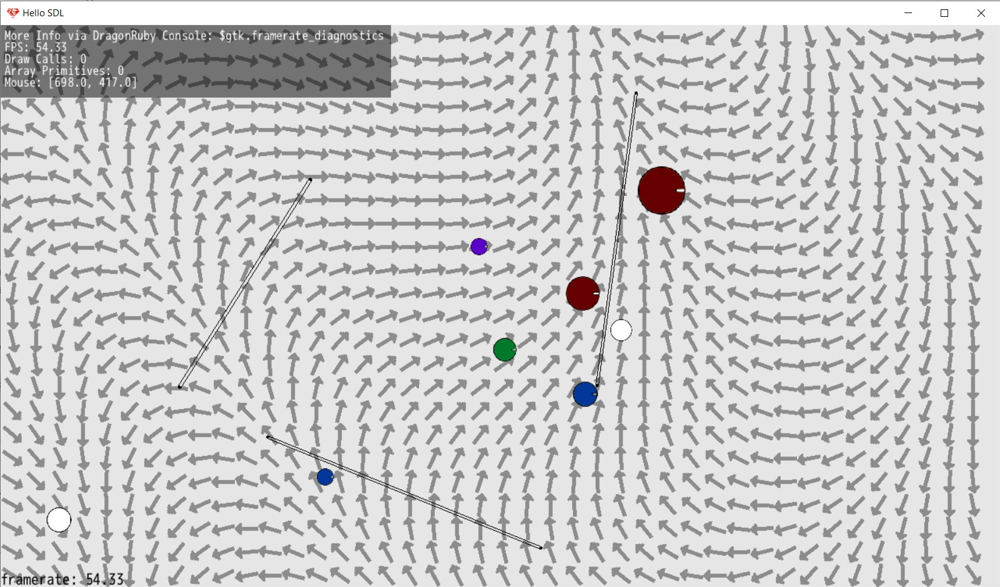

This is a collection of my previous projects in Dragon Ruby that aren't already repos.
To run these, put the inlcude directory, dragonruby.exe, and font.ttf files in the toplevel directory.
From there you can use any of the run.bat files to run the programs.
The pre.bat files compile the C scripts, but will need you to change the path.
Also, most of these use DRPro features.

For the pictures:
Dino by GDJ https://pixabay.com/vectors/tyrannosaurus-rex-dinosaur-t-rex-6863934/
Bird by ViolkaArt https://pixabay.com/vectors/bird-ornithology-hand-drawing-6982028/
